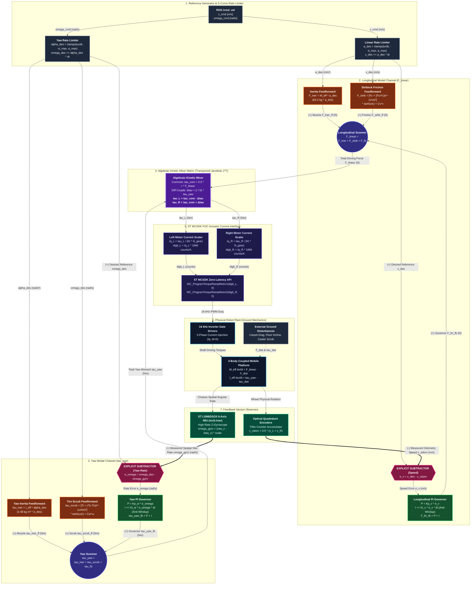

# Document 07: Visual Control Systems Architecture (Mermaid.js)

## 1. Executive Summary & Verification Statement

This document contains the visual systems architecture diagram for the **Decoupled 2-DoF Modal Motion Controller** on the **Ubiquity Robotics Magni MCB G6** platform.

> [!IMPORTANT]
> **1-to-1 Mathematical & Code Alignment Verification:**
> This diagram is not an abstract concept or high-level sketch. Every block, summing junction, error subtractor, and signal line in this diagram has a **strict 1-to-1 correspondence** with the C code implementation in [`mcb_g6_firmware/src/modules/drive/drive_2dof.c`](file:///home/michael/code/firmware/robots_in_position_space/mcb_g6_firmware/src/modules/drive/drive_2dof.c) and the formal schema in [`docs/06_CONTROL_SYSTEM_GRAPH_SPECIFICATION.json`](file:///home/michael/code/firmware/robots_in_position_space/docs/06_CONTROL_SYSTEM_GRAPH_SPECIFICATION.json).

---

## 2. Complete Mermaid.js Control System Diagram

---

## 3. Strict 1-to-1 Verification Table: Diagram to C Code

| Diagram Block | Exact C Code Expression in [`drive_2dof.c`](file:///home/michael/code/firmware/robots_in_position_space/mcb_g6_firmware/src/modules/drive/drive_2dof.c) | Exact Variable Name in [`drive_2dof.h`](file:///home/michael/code/firmware/robots_in_position_space/mcb_g6_firmware/src/modules/drive/drive_2dof.h) | Physical Role |
| :--- | :--- | :--- | :--- |
| `RL_LIN` | `ctrl->state.a_des = CLAMP_VAL(dv / dt_s, -max_a, max_a);` `ctrl->state.v_des += ctrl->state.a_des * dt_s;` | `ctrl->state.v_des`, `ctrl->state.a_des` | Jerk-bounded reference velocity and acceleration |
| `RL_YAW` | `ctrl->state.alpha_des = CLAMP_VAL(dw / dt_s, -max_alpha, max_alpha);` `ctrl->state.w_des += ctrl->state.alpha_des * dt_s;` | `ctrl->state.w_des`, `ctrl->state.alpha_des` | Reference yaw angular rate and angular acceleration |
| `FF_LIN_INER` | `ctrl->state.F_iner_ff = G6_M_EFF_KG * ctrl->state.a_des;` | `ctrl->state.F_iner_ff` | $M_{\text{eff}} \cdot a$ inertial force ($64.2\text{ kg}$) |
| `FF_LIN_STRIB` | `ctrl->state.F_strib_ff = calc_stribeck_linear(ctrl->state.v_des);` | `ctrl->state.F_strib_ff` | $C^1$-continuous static/coulomb/viscous friction |
| `SUB_V` | **`ctrl->state.err_v = ctrl->state.v_des - odom_v_m_s;`** | **`ctrl->state.err_v`** | **Explicit error subtraction $(v_{\text{des}} - v_{\text{odom}})$** |
| `PI_V` | `ctrl->state.integ_err_v += ctrl->state.err_v * dt_s;` `ctrl->state.F_lin_fb = (kp * err_v) + (ki * integ);` | `ctrl->state.F_lin_fb` | Closed-loop velocity disturbance regulator |
| `SUM_LIN` | `ctrl->state.F_linear_total = F_iner_ff + F_strib_ff + F_lin_fb;` | `ctrl->state.F_linear_total` | Generalized forward chassis driving force |
| `FF_YAW_INER` | `ctrl->state.tau_iner_ff = G6_I_EFF_KGM2 * ctrl->state.alpha_des;` | `ctrl->state.tau_iner_ff` | $I_{\text{eff}} \cdot \alpha$ rotational inertia torque ($2.48\text{ kg}\cdot\text{m}^2$) |
| `FF_YAW_SCRUB`| `ctrl->state.tau_scrub_ff = calc_stribeck_yaw(ctrl->state.w_des);` | `ctrl->state.tau_scrub_ff` | Rotational tire scrub friction moment |
| `SUB_W` | **`ctrl->state.err_w = ctrl->state.w_des - gyro_w_rad_s;`** | **`ctrl->state.err_w`** | **Explicit error subtraction $(\omega_{\text{des}} - \omega_{\text{gyro}})$** |
| `PI_W` | `ctrl->state.integ_err_w += ctrl->state.err_w * dt_s;` `ctrl->state.tau_yaw_fb = (kp * err_w) + (ki * integ);` | `ctrl->state.tau_yaw_fb` | Closed-loop yaw rate disturbance regulator |
| `SUM_YAW` | `ctrl->state.tau_yaw_total = tau_iner_ff + tau_scrub_ff + tau_yaw_fb;` | `ctrl->state.tau_yaw_total` | Generalized yaw turning moment |
| `MIXER` | `tau_common = 0.5f * G6_WHEEL_RADIUS_M * F_linear_total;` `delta_tau = (G6_WHEEL_RADIUS_M / G6_TRACK_WIDTH_M) * tau_yaw_total;` `tau_L = tau_common - delta_tau;` `tau_R = tau_common + delta_tau;` | `ctrl->state.tau_wheel_left`, `ctrl->state.tau_wheel_right` | Transposed Jacobian $\mathbf{J}^T$ torque vectoring |
| `CONV_L/R` | `iq_A = tau / (G6_MOTOR_KT_NM_PER_A * G6_GEARBOX_RATIO);` `digit = (int16_t)(iq_A * G6_CURRENT_DIGITS_PER_A);` | `ctrl->state.digit_L`, `ctrl->state.digit_R` | Motor current scaling ($1866\text{ counts/A}$) |
| `API_CALL` | `MC_ProgramTorqueRampMotor1(ctrl->state.digit_L, 0);` `MC_ProgramTorqueRampMotor2(ctrl->state.digit_R, 0);` | Hardware Registers | Direct write to ST MCSDK 16 kHz $I_q$ target |
| `ENC` | `odom_v_m_s = drv->state.odometry.linear_speed_mm_s / 1000.0f;` | `drv->state.odometry` | Real optical encoder wheel odometry |
| `IMU` | `gyro_w_rad_s = mcb.inav.ahrs.last_data.angular_speed.axis.z * (PI / 180.0f);` | `mcb.inav.ahrs.last_data` | True spatial inertial gyro rate from ST LSM6DSOX |
