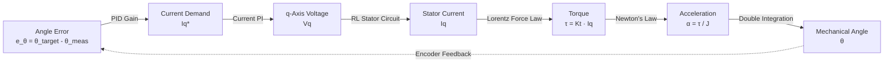

# Document 10: Socratic Inquiries on Mobile Robot Physics & Control

## Preface: The Socratic Methodology in Mechatronics

When designing safety-critical motion firmware for heavy outdoor mobile platforms (such as the Ubiquity Robotics Magni MCB G6 microtractor navigating unpaved agricultural soils), standard textbook control recipes frequently fail. 

This document captures the **first-principles dialogues, sharp technical inquiries, and counter-intuitive paradoxes** raised during the architectural audit of the legacy ST MCSDK control stack and the derivation of the **Decoupled 2-DoF Modal Impedance Engine**.

---

## Dialogue I: The Wheel Spin in Mud vs. Frictionless Ice Dilemma

### The Inquiry & Counter-Argument
> **The Inquirer:**  
> *"Wait a minute! You established the physical causality chain:*
> $$I_q \xrightarrow{\times K_t} \tau \xrightarrow{\div J} \alpha \xrightarrow{\int dt} \omega \xrightarrow{\int dt} \theta$$
> *Current produces torque, torque produces acceleration, acceleration produces velocity, and velocity produces position over time.*  
> *Then you claimed that when the robot enters mud, the legacy position controller suffers from runaway error: $(\theta_{\text{target}} - \theta_{\text{actual}})$ blows up, forcing the position PID to dump 100% saturation current, violently spinning the tire and digging a trench.*  
> *Why would the error blow up if the wheels are spinning? If the wheel is spinning, the motor encoder on the back of the motor shaft is rotating! Therefore, $\theta_{\text{actual}}$ is advancing! Shouldn't the error stay near zero or even catch up to $\theta_{\text{target}}$? Why would it blow up into max saturation?"*

### The First-Principles Resolution
> **The Control Theorist:**  
> *"You have pinpointed the exact reason why off-road traction mechanics cannot be treated like high-school physics on frictionless surfaces. We must distinguish between two completely different physical regimes:*
> 1. **Frictional Surface Shearing & High Soil Resistance (Real Mud & Ruts)**
> 2. **Near-Zero Friction Slip (Wet Sheet Ice / Aquaplaning)**

```
┌─────────────────────────────────────────────────────────────────────────────────────────────┐
│                             TERRAIN INTERACTION TAXONOMY                                    │
├──────────────────────────────────────────────┬──────────────────────────────────────────────┤
│          REGIME A: SOIL RUT (MUD)            │          REGIME B: SLICK ICE                 │
├──────────────────────────────────────────────┼──────────────────────────────────────────────┤
│ • High rolling resistance (50 Nm berm)       │ • Near-zero rolling resistance (< 1 Nm)      │
│ • Initial state: Mechanical stall            │ • Initial state: Instant free rotation       │
│ • Encoder angle: FROZEN (θ_actual = 0)       │ • Encoder angle: ROTATING (θ_actual tracks)  │
│ • Position error: BLOWS UP                   │ • Position error: Near zero                  │
│ • Result: Saturation torque -> Soil Shears   │ • Result: Wheel spins, chassis stationary    │
└──────────────────────────────────────────────┴──────────────────────────────────────────────┘
```

#### 1. What Actually Happens in Mud (Regime A)
When an outdoor agricultural robot enters wet soil:
* It does not hit a frictionless ice rink. It sinks $5\text{--}10\text{ cm}$ into loose loam. A heavy berm of compressed mud forms directly in front of the tire tread.
* To turn the wheel over this berm requires **$50\text{ Nm}$** of mechanical torque.
* The nominal cruising torque required on flat asphalt is only **$5\text{ Nm}$**.
* At the moment of contact, the wheel **mechanically stalls**. The rotor is locked by the dirt.
* Therefore, **$\theta_{\text{actual}}$ stops dead at $0\text{ rad}$**.
* Meanwhile, the legacy firmware in [`src/modules/drive/drive.c#L575`](file:///home/michael/code/firmware/mcb_g6_firmware/src/modules/drive/drive.c#L575) has no contact sensor. It blindly marches forward:
  $$\theta_{\text{target}}[k] = \theta_{\text{target}}[k-1] + \frac{v_{\text{cmd}} \cdot \Delta t}{r}$$
* Over the next $500\text{ ms}$, $\theta_{\text{target}}$ advances to $25\text{ rad}$, while $\theta_{\text{actual}}$ is stuck at $0.1\text{ rad}$.
* **The Error Blowup:** $e_\theta = 25 - 0.1 = 24.9\text{ rad}$!
* The Position PID controller sees this massive angular error and ramps the commanded quadrature current to its maximum hardware limit:
  $$I_q^* = I_{\text{max}} = 35\text{ A} \implies \tau = K_t \cdot I_{\text{max}} \approx 70\text{ Nm}$$
* At $70\text{ Nm}$, the tire cleats exceed the **shear strength of the soil**. The soil structure tears away.
* The moment the soil yields, mechanical resistance drops instantaneously from $50\text{ Nm}$ to $2\text{ Nm}$.
* Because the controller is already commanding $100\%$ saturation torque against an inertia that just dropped by $95\%$, Newton's law ($\alpha = \frac{\tau}{J}$) dictates an astronomical angular acceleration. The tire **explodes into a violent high-RPM spin**, throwing mud and digging the axle directly into the dirt.

#### 2. What Happens on Frictionless Ice (Regime B)
On polished wet ice, your intuition is completely correct:
* The wheel encounters no resistance. The motor turns effortlessly.
* The motor encoder counts pulses, so $\theta_{\text{actual}}$ matches $\theta_{\text{target}}$ perfectly.
* **The motor-level position error does NOT blow up.**
* **The Catastrophe is Transferred to the Chassis:**
  * The wheel encoder tells the odometry system: *"I have traveled 100 meters forward!"*
  * The chassis IMU, GPS, and LiDAR tell the navigation node: *"We are stationary. Position = 0 m."*
  * High-level Nav2 looks at the map and commands more speed: *"We are behind schedule, increase $v_{\text{cmd}}$!"*
  * The wheel spins faster and faster while the robot sits still.
  * **The Mechanical Shock:** The instant that spinning tire slips off the ice and touches a patch of dry stone or tarmac, the wheel drops from $20\text{ rad/s}$ to $0\text{ rad/s}$ in 1 millisecond. The rotational kinetic energy ($E_k = \frac{1}{2} J \omega^2$) slams straight into the planetary gearbox teeth, stripping gears or shearing shaft keys.

#### 3. How Velocity Impedance Resolves Both Regimes
In our Decoupled 2-DoF controller ([`drive_2dof.c`](file:///home/michael/code/firmware/mcb_g6_firmware/src/modules/drive/drive_2dof.c)):
* **In Mud:** There is no position error $\Delta \theta$ accumulating over time. The velocity error $e_v = v_{\text{des}} - v_{\text{odom}}$ is passed through an integral trimmer strictly clamped to a safe, non-destructive limit ($120\text{ N}$). It applies measured, bounded effort without winding up into an explosive torque dump.
* **On Ice:** The instant the wheel breaks traction and accelerates beyond the target trajectory speed ($v_{\text{wheel}} > v_{\text{des}}$), the virtual viscous damper:
  $$F_{\text{damper}} = B_d \cdot (v_{\text{des}} - v_{\text{wheel}}) < 0$$
  immediately injects **negative dynamic braking torque**. It limits wheel spin to the commanded trajectory velocity, keeping the tire primed to regain grip without shocking the mechanical drivetrain.

---

## Dialogue II: The Integration $\to$ Differentiation $\to$ Re-Integration Paradox

### The Inquiry & Counter-Argument
> **The Inquirer:**  
> *"Looking at the legacy control path from ROS to the motor, we see this absurd sequence:*
> 1. *In `drive.c` (Line 575): It takes commanded speed and **integrates** it into an artificial angle target: $\theta_{\text{target}} \mathrel{+}= \omega \cdot \Delta t$.*
> 2. *In `trajectory_ctrl.c` (Line 157): It takes that angle target and **differentiates** it back into velocity: $\omega = \frac{\Delta \theta}{\Delta t}$.*
> 3. *In `trajectory_ctrl.c` (Line 309): It takes that velocity and **integrates** it again on every 1 ms tick: $\theta_{\text{ref}} \mathrel{+}= \omega \cdot 1\text{ ms}$.*
> *Why would any competent engineer design a system that integrates, differentiates, and re-integrates the exact same signal? Isn't this just a Rube Goldberg machine of numerical errors?"*

### The First-Principles Resolution
> **The Control Theorist:**  
> *"It appears absurd on the surface, but it arose from a fundamental **architectural impedance mismatch** between two different software teams and three different clock domains:*
> * **Team A (Robotics Software):** Designed the vehicle as a unicycle velocity follower (`cmd_vel` in m/s).
> * **Team B (ST Microelectronics SDK):** Designed an off-the-shelf industrial motor position servo library (`MC_ProgramPositionCommandMotor1`).
> * **The Three Clocks:**
>   - Clock 1: ROS 2 node publishing at **$20\text{--}50\text{ Hz}$** ($20\text{--}50\text{ ms}$).
>   - Clock 2: MCU driver loop running at **$50\text{--}100\text{ Hz}$** ($10\text{--}20\text{ ms}$).
>   - Clock 3: Motor position regulation ISR running at **$1{,}000\text{ Hz}$** ($1\text{ ms}$).

#### The Mechanics of the Rate-Transition Bridge
If the MCU received an angle setpoint every $20\text{ ms}$ and simply held it constant (a Zero-Order Hold), the high-frequency $1\text{ kHz}$ position PID controller would see a **staircase**:

$$\text{Error at } t = 0\text{ ms}: \Delta \theta = 0.2\text{ rad} \implies \text{Massive torque jerk!}$$
$$\text{Error at } t = 1\text{ to } 19\text{ ms}: \Delta \theta \to 0 \implies \text{Torque drops to zero.}$$
$$\text{Error at } t = 20\text{ ms}: \Delta \theta \text{ steps up again} \implies \text{Another violent torque jerk!}$$

To eliminate this violent $50\text{ Hz}$ acoustic buzzing, ST engineers implemented a **2nd-Order Taylor Extrapolator**:
1. **Differentiation:** When a new packet arrives, ST calculates $\omega_{\text{est}} = \frac{\Delta \theta}{\Delta t}$ and $\alpha_{\text{est}} = \frac{\Delta \omega}{\Delta t}$. This extracts the velocity and acceleration slopes of your sparse incoming stream.
2. **Re-Integration:** On every $1\text{ ms}$ tick between your packets, ST integrates:
   $$\theta_{\text{ref}}[m] = \theta_{\text{ref}}[m-1] + \omega_{\text{est}} \cdot 1\text{ ms}$$
   This smoothly reconstructs the **19 missing intermediate setpoints**, transforming the staircase into a smooth curve.

#### Why It Remains Fundamentally Flawed for Mobile Robots
While clever as a standalone servo interpolator, combining it with an outer velocity-to-position integrator in `drive.c` is deeply flawed:
* **Quantization Noise:** Numerically differentiating floating-point numbers subject to serial transmission jitter amplifies high-frequency noise.
* **Phase Lag:** The differentiation and filtering introduce $10\text{--}30\text{ ms}$ of phase delay.
* **Integrator Windup:** As proven in Dialogue I, turning a velocity command into a position target creates a persistent memory of lost distance whenever a wheel slips.

#### The Decoupled 2-DoF Solution
Our Decoupled 2-DoF Controller ([`drive_2dof.c`](file:///home/michael/code/firmware/mcb_g6_firmware/src/modules/drive/drive_2dof.c)) completely dissolves this paradox. By remaining natively in the velocity/force domain, it computes torque directly from $v_{\text{cmd}}$ and $a_{\text{des}}$, injecting effort straight into the FOC torque bus. **Zero integrations, zero numerical differentiations, zero noise.**

---

## Dialogue III: The Mystery of Duration = 0

### The Inquiry & Counter-Argument
> **The Inquirer:**  
> *"In `drive.c` (Line 58), the code calls:*
> ```c
> MC_ProgramPositionCommandMotor1(drv->state.target_rad[DRIVE_M1], 0);
> ```
> *What is that second argument `0`? If you ask a motor to move to an angle in 0 seconds, isn't that physically impossible? Why does passing 0 not trigger a division-by-zero fault?"*

### The First-Principles Resolution
> **The Control Theorist:**  
> *"In ST's Motor Control SDK, the second parameter `fDuration` is a **modality switch**, not a literal physical duration:*

```c
// ST MCSDK Implementation in mc_interface.c (Line 153)
void MCI_ExecPositionCommand(MCI_Handle_t *pHandle, float FinalPosition, float Duration)
{
    if (Duration > 0) {
        // Point-to-Point Motion Profile Mode
        TC_MoveCommand(pHandle->pPosCtrl, currentPosition, FinalPosition - currentPosition, Duration);
    } else {
        // Streamed Follow Mode
        TC_FollowCommand(pHandle->pPosCtrl, FinalPosition);
    }
}
```

* **When `Duration > 0` (e.g., `3.0f`):** You are telling the motor: *"I am giving you a single static waypoint. Plan a complete trapezoidal or S-curve motion profile with jerk limits to arrive at this angle in exactly 3 seconds."*
* **When `Duration == 0`:** You are telling the motor: *"Do NOT plan an internal trajectory. I am an external trajectory generator streaming dynamic setpoints to you in real time. Switch to Follow Mode and track this stream immediately!"*

---

## Dialogue IV: Achieving Mechanical Position via Quadrature Voltage ($V_q$)

### The Inquiry & Counter-Argument
> **The Inquirer:**  
> *"Field Oriented Control (FOC) ultimately outputs PWM voltages to the inverter gates. But how does commanding quadrature voltage $V_q$ result in a physical rotor holding an exact mechanical angle $\theta$? $V_q$ is just a voltage component in a rotating mathematical reference frame!"*

### The First-Principles Resolution
> **The Control Theorist:**  
> *"The connection between $V_q$ and mechanical position $\theta$ is governed by four coupled physical laws that synthesize a **Virtual Magnetic Spring**:"*



1. **The Park Reference Frame:**
   FOC aligns the coordinate system with the permanent magnets on the rotor:
   * The $d$-axis points directly along the rotor magnetic flux. Voltage applied here only creates radial compressive stress. FOC regulates $I_d = 0$.
   * The $q$-axis points $90^\circ$ electrical ahead. **All tangential electromagnetic force is produced here.**
2. **The Stator Circuit Equation:**
   Applying voltage $V_q$ drives current through the stator coil inductance ($L$) and resistance ($R$):
   $$V_q = R_s I_q + L_q \frac{dI_q}{dt} + \omega_e \psi_f$$
3. **Lorentz Force Law (Torque Generation):**
   The interaction between the permanent magnet flux ($\psi_f$) and the quadrature current ($I_q$) produces mechanical torque:
   $$\tau = \frac{3}{2} p \cdot \psi_f \cdot I_q = K_t \cdot I_q$$
4. **Newton's Second Law & Double Integration:**
   $$\alpha = \frac{\tau - \tau_{\text{load}}}{J} \implies \omega = \int \alpha \, dt \implies \theta = \int \omega \, dt$$
5. **The Virtual Magnetic Spring:**
   Because the position regulator sets $I_q^* = K_p (\theta_{\text{target}} - \theta_{\text{actual}})$, the torque produced is:
   $$\tau = (K_t \cdot K_p) \cdot \Delta \theta \equiv K_{\text{virtual\_spring}} \cdot \Delta \theta$$
   Commanding $V_q$ proportional to angular error creates an **energetic magnetic potential well**. The rotor magnets are physically pulled toward the bottom of this well where $\Delta \theta = 0$, holding the shaft locked in position.

---

## Dialogue V: Cascaded Rigid Position vs. Velocity-Domain Impedance

### The Inquiry & Counter-Argument
> **The Inquirer:**  
> *"Why cannot we simply use classical cascaded position control and tune the proportional gains softer for outdoor terrain? Why must we discard position control on the wheels entirely and replace it with Velocity-Domain Impedance?"*

### The First-Principles Resolution
> **The Control Theorist:**  
> *"Because of the fundamental topological difference between a robotic arm joint and a rolling wheel.*
> * In a robot arm joint, the coordinate space is **compact and bounded**: $\theta \in [-\pi, +\pi]$. The link interacts with its environment at fixed distances.
> * In a wheeled vehicle, the rolling angle is **non-compact and unbounded**: $\theta \in \mathbb{R}^1 \to \infty$. A wheel is a continuous velocity-domain propulsor."

```
┌─────────────────────────────────────────────────────────────────────────────────────────────┐
│                            STRUCTURAL TOPOLOGY COMPARISON                                   │
├──────────────────────────────────────────────┬──────────────────────────────────────────────┤
│         CASCADED POSITION CONTROL            │          VELOCITY IMPEDANCE CONTROL          │
├──────────────────────────────────────────────┼──────────────────────────────────────────────┤
│ • Port Impedance: Z(s) -> ∞ at DC            │ • Port Impedance: Z(s) = B_d + Ki/s          │
│ • Acts as an infinite stiffness brick wall   │ • Acts as a programmable viscous fluid       │
│ • Non-passive on rigid rocks (chatter)       │ • Strictly passive (unconditionally stable)  │
│ • Trailing disturbance rejection             │ • Bilateral energetic exchange               │
│ • Memory of lost revolutions (windup)        │ • Invariant to distance traveled (no windup) │
└──────────────────────────────────────────────┴──────────────────────────────────────────────┘
```

#### The Port Impedance Proof ($Z(s)$)
In physical interaction control (Hogan, 1985), mechanical impedance relates force to velocity:
$$Z(s) = \frac{F(s)}{v(s)}$$

* **In Cascaded Position Control:**
  Because the position error integrates velocity ($e_\theta = \frac{v_{\text{des}} - v}{s}$), the impedance transfer function is:
  $$Z(s) = \frac{K_p}{s} + B + M s$$
  As frequency approaches zero (steady contact with an obstacle), **$\lim_{s \to 0} Z(s) = \infty$**. The robot presents **infinite mechanical rigidity**. If it hits a boulder, it cannot yield compliantly; it must either crush the boulder or destroy its own transmission.
* **In Velocity Impedance Control ([`drive_2dof.c`](file:///home/michael/code/firmware/mcb_g6_firmware/src/modules/drive/drive_2dof.c)):**
  The impedance transfer function is:
  $$Z(s) = B_d + \frac{K_i}{s}$$
  At high frequencies (sudden dynamic impacts), $\lim_{\omega \to \infty} Z(j\omega) = B_d$. The robot presents a **finite, strictly dissipative viscous cushion**. It absorbs mechanical shocks, preserves gearbox teeth, and maintains continuous wheel-ground traction across rocks, furrows, and ruts.
