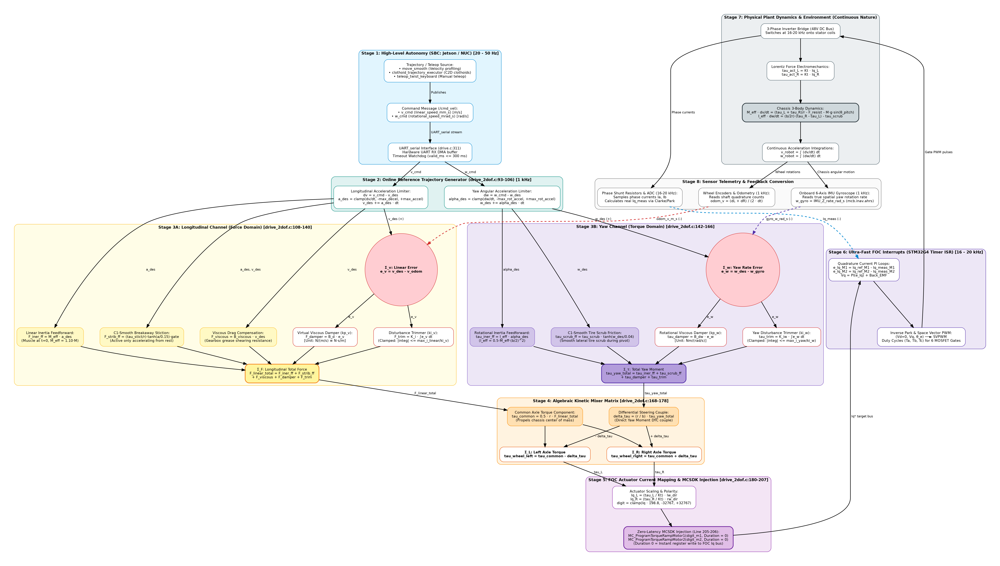

# Document 11: Decoupled 2-DoF Force-Velocity Impedance Control Topology

## 1. Master Architecture Diagram



> **Vector Graphic:** View the lossless vector rendering at [control_diagrams/velocity_impedance_control_system.svg](control_diagrams/velocity_impedance_control_system.svg).  
> **Online Editing:** The raw Mermaid definition can be copied from [control_diagrams/velocity_impedance_control_system.mmd](control_diagrams/velocity_impedance_control_system.mmd) and edited directly in [mermaid.live](https://mermaid.live).

---

## 2. The 8 Physical Stages & Firmware Implementation

This control architecture directly eliminates the cascaded position loop and the artificial position integration in [`drive.c`](file:///home/michael/code/firmware/mcb_g6_firmware/src/modules/drive/drive.c). It treats the physical robot as a **bilateral energy port** interacting compliantly with outdoor terrain.

### Stage 1: High-Level Autonomy (SBC) [$20\text{--}50\text{ Hz}$]
* **Sources:**
  * `move_smooth`: Generates jerk-bounded smooth velocity transitions.
  * `clothoid_trajectory_executor`: Evaluates continuous Fresnel-integral clothoids into discrete tangent velocity vectors $(v, \omega)$.
  * `teleop_twist_keyboard`: Manual operator input.
* **Message Payload (`/cmd_vel`):**
  * `v_cmd` (`linear_speed_mm_s`): Forward chassis velocity setpoint.
  * `w_cmd` (`rotational_speed_mrad_s`): Angular yaw rate setpoint.
* **Comms Layer:**
  Streamed across hardware `UART_serial` with DMA reception, guarded by an active $300\text{ ms}$ timeout watchdog ([`drive.c#L380`](file:///home/michael/code/firmware/mcb_g6_firmware/src/modules/drive/drive.c#L380)).

---

### Stage 2: Online Reference Generator [$1{,}000\text{ Hz}$]
* **Firmware Location:** [`src/modules/drive/drive_2dof.c#L93-L106`](file:///home/michael/code/firmware/mcb_g6_firmware/src/modules/drive/drive_2dof.c#L93-L106)
* **Longitudinal S-Curve Rate Limiting:**
  $$dv = v_{\text{cmd}} - v_{\text{des}}$$
  $$a_{\text{unbounded}} = \frac{dv}{\Delta t_{\text{sample}}}$$
  $$a_{\text{des}} = \text{clamp}(a_{\text{unbounded}}, -a_{\text{max\_decel}}, +a_{\text{max\_accel}})$$
  $$v_{\text{des}} \mathrel{+}= a_{\text{des}} \cdot \Delta t_{\text{sample}}$$
* **Yaw Angular Rate Limiting:**
  $$dw = \omega_{\text{cmd}} - \omega_{\text{des}}$$
  $$\alpha_{\text{unbounded}} = \frac{dw}{\Delta t_{\text{sample}}}$$
  $$\alpha_{\text{des}} = \text{clamp}(\alpha_{\text{unbounded}}, -\alpha_{\text{max\_rot}}, +\alpha_{\text{max\_rot}})$$
  $$\omega_{\text{des}} \mathrel{+}= \alpha_{\text{des}} \cdot \Delta t_{\text{sample}}$$

---

### Stage 3A: Longitudinal Modal Channel (Force Domain)
* **Firmware Location:** [`src/modules/drive/drive_2dof.c#L108-L140`](file:///home/michael/code/firmware/mcb_g6_firmware/src/modules/drive/drive_2dof.c#L108-L140)
* **Effective Linear Mass:**
  $$M_{\text{eff}} = M_{\text{chassis}} + 2 m_{\text{wheel}} + 2 \frac{I_{\text{wheel}}}{r^2} \approx 1.10 \cdot M_{\text{nominal}}$$

#### 1. Feedforward Muscle
* **Inertial Force (Acceleration at $t=0$):**
  $$F_{\text{iner\_ff}} = M_{\text{eff}} \cdot a_{\text{des}}$$
* **$C^1$-Smooth Breakaway Stiction Compensation:**
  Gated strictly to breakaway acceleration from near-rest ($|v_{\text{des}}| < 4\epsilon$):
  $$F_{\text{strib\_ff}} = \frac{\tau_{\text{stiction}}}{r} \cdot \tanh\left(\frac{a_{\text{des}}}{0.15}\right) \cdot \left[1 - \frac{|v_{\text{des}}|}{4\epsilon}\right]^+$$
* **Viscous Grease Shear Drag:**
  $$F_{\text{viscous}} = B_{\text{viscous}} \cdot v_{\text{des}}$$

#### 2. Virtual Viscous Damper & Disturbance Trim
* **Summing Element $\Sigma_v$ (Linear Velocity Error):**
  $$e_v = v_{\text{des}} - v_{\text{odom}}$$
* **Virtual Viscous Damper ($B_d$):**
  $$F_{\text{damper}} = K_{p,v} \cdot e_v \quad \left[\text{Unit: } \frac{\text{N}}{\text{m/s}} \equiv \text{N}\cdot\text{s/m} \equiv B_d\right]$$
* **Integral Disturbance Trimmer ($K_i$ with anti-windup clamp):**
  $$F_{\text{trim}} = K_{i,v} \int e_v \, dt, \quad \left|\int e_v dt\right| \le \frac{\text{MAX\_I\_LINEAR\_N}}{K_{i,v}} \quad (120\text{ N limit})$$
* **Summing Element $\Sigma_F$ (Total Longitudinal Modal Force):**
  $$F_{\text{linear\_total}} = F_{\text{iner\_ff}} + F_{\text{strib\_ff}} + F_{\text{viscous}} + F_{\text{damper}} + F_{\text{trim}}$$

---

### Stage 3B: Yaw Modal Channel (Torque Domain)
* **Firmware Location:** [`src/modules/drive/drive_2dof.c#L142-L166`](file:///home/michael/code/firmware/mcb_g6_firmware/src/modules/drive/drive_2dof.c#L142-L166)
* **Effective Yaw Inertia:**
  $$I_{\text{eff}} = 0.5 \cdot M_{\text{eff}} \cdot \left(\frac{b}{2}\right)^2$$

#### 1. Feedforward Muscle
* **Rotational Inertia Moment:**
  $$\tau_{\text{iner\_ff}} = I_{\text{eff}} \cdot \alpha_{\text{des}}$$
* **$C^1$-Smooth Lateral Tire Scrub Friction:**
  $$\tau_{\text{scrub\_ff}} = \tau_{\text{scrub\_nominal}} \cdot \tanh\left(\frac{\omega_{\text{des}}}{0.04}\right)$$

#### 2. Rotational Damper & Trimmer
* **Summing Element $\Sigma_\omega$ (Yaw Velocity Error):**
  $$e_\omega = \omega_{\text{des}} - \omega_{\text{gyro}}$$
  *(Where $\omega_{\text{gyro}}$ is sampled directly from the onboard 6-axis IMU rate gyroscope).*
* **Rotational Viscous Damper ($B_{d,\omega}$):**
  $$\tau_{\text{damper}} = K_{p,w} \cdot e_\omega \quad \left[\text{Unit: } \frac{\text{N}\cdot\text{m}}{\text{rad/s}} \equiv B_{d,\omega}\right]$$
* **Yaw Integral Trimmer ($K_{i,\omega}$ with anti-windup clamp):**
  $$\tau_{\text{trim}} = K_{i,w} \int e_\omega \, dt, \quad \left|\int e_\omega dt\right| \le \frac{\text{MAX\_I\_YAW\_NM}}{K_{i,w}} \quad (25\text{ Nm limit})$$
* **Summing Element $\Sigma_\tau$ (Total Yaw Turning Moment):**
  $$\tau_{\text{yaw\_total}} = \tau_{\text{iner\_ff}} + \tau_{\text{scrub\_ff}} + \tau_{\text{damper}} + \tau_{\text{trim}}$$

---

### Stage 4: Algebraic Kinetic Mixer Matrix ($\boldsymbol{\tau} = \mathbf{J}^T \mathbf{W}$)
* **Firmware Location:** [`src/modules/drive/drive_2dof.c#L168-L178`](file:///home/michael/code/firmware/mcb_g6_firmware/src/modules/drive/drive_2dof.c#L168-L178)
* Maps the generalized chassis modal wrench $[F_{\text{linear\_total}}, \tau_{\text{yaw\_total}}]^T$ into individual left and right axle torques without cross-coupling phase lag:

$$\begin{bmatrix} \tau_{\text{wheel\_left}} \\ \tau_{\text{wheel\_right}} \end{bmatrix} = \begin{bmatrix} \frac{r}{2} & -\frac{r}{b} \\ \frac{r}{2} & +\frac{r}{b} \end{bmatrix} \begin{bmatrix} F_{\text{linear\_total}} \\ \tau_{\text{yaw\_total}} \end{bmatrix}$$

* **Common Mode Torque:**
  $$\tau_{\text{common}} = 0.5 \cdot r \cdot F_{\text{linear\_total}}$$
* **Differential Steering Couple:**
  $$\Delta \tau = \frac{r}{b} \cdot \tau_{\text{yaw\_total}}$$
* **Summing Elements $\Sigma_L$ & $\Sigma_R$:**
  $$\tau_{\text{wheel\_left}} = \tau_{\text{common}} - \Delta \tau$$
  $$\tau_{\text{wheel\_right}} = \tau_{\text{common}} + \Delta \tau$$

---

### Stage 5: FOC Current Mapping & Zero-Latency MCSDK Injection
* **Firmware Location:** [`src/modules/drive/drive_2dof.c#L180-L207`](file:///home/michael/code/firmware/mcb_g6_firmware/src/modules/drive/drive_2dof.c#L180-L207)
* Converts mechanical axle torque into motor quadrature current ($I_q$):
  $$I_{q,L} = \frac{\tau_{\text{wheel\_left}}}{K_t} \cdot \text{lw\_dir}, \quad I_{q,R} = \frac{\tau_{\text{wheel\_right}}}{K_t} \cdot \text{rw\_dir}$$
* Scales Amperes to ST MCSDK digital current counts ($198.8\text{ digits/A}$):
  $$\text{digit} = \text{clamp}(I_q \cdot 198.8, -32767, +32767)$$
* **Zero-Latency Register Injection:**
  ```c
  MC_ProgramTorqueRampMotor1(digit_m1, 0); // Duration 0 = Direct immediate write
  MC_ProgramTorqueRampMotor2(digit_m2, 0);
  ```

---

### Stage 6: Ultra-Fast FOC Interrupts [$16\text{--}20\text{ kHz}$]
* Synchronized with ADC conversion at the PWM switching midpoint ($50\text{--}62.5\ \mu\text{s}$).
* **Current Regulators (2 Parallel PI Loops):**
  * $\Sigma_{Iq}$: $e_{Iq} = I_q^* - I_{q,\text{meas}} \implies V_q = \text{PI}(e_{Iq}) + \omega_e \psi_f$
  * $\Sigma_{Id}$: $e_{Id} = 0 - I_{d,\text{meas}} \implies V_d = \text{PI}(e_{Id}) - \omega_e L_q I_q$
* **Inverse Park & SVPWM:** Generates 3-phase gate pulses $(T_a, T_b, T_c)$ for the 6 MOSFET inverter bridge.

---

### Stage 7: Physical Plant Dynamics & Environment (Continuous Nature)
1. **Inverter & RL Stator Circuit:**
   $$V_q = R_s I_q + L_q \frac{dI_q}{dt} + \text{Back-EMF}$$
2. **Lorentz Force Electromechanical Torque:**
   $$\tau_{\text{act}} = \frac{3}{2} p \cdot \psi_f \cdot I_q = K_t \cdot I_q$$
3. **Chassis 3-Body Dynamics (Newton-Euler):**
   $$M_{\text{eff}} \frac{dv}{dt} = \frac{\tau_L + \tau_R}{r} - F_{\text{resistance}} - M g \sin(\theta_{\text{pitch}})$$
   $$I_{\text{eff}} \frac{d\omega}{dt} = \frac{b}{2r}(\tau_R - \tau_L) - \tau_{\text{scrub}}$$
4. **Nature's Integrators:**
   $$v(t) = \int \dot{v} \, dt, \quad \omega(t) = \int \dot{\omega} \, dt$$

---

### Stage 8: Sensor Telemetry & Feedback Channels
1. **Linear Wheel Odometry ($1\text{ kHz}$):**
   Quadrature encoders report shaft position increments $\Delta \theta_L, \Delta \theta_R$:
   $$v_{\text{odom}} = \frac{r}{2} \left(\frac{\Delta \theta_L}{\Delta t} + \frac{\Delta \theta_R}{\Delta t}\right)$$
   Feeds into **Summing Element $\Sigma_v$** with negative sign.
2. **Spatial Inertial Gyroscope ($1\text{ kHz}$):**
   Onboard 6-axis IMU (e.g. LSM6DSL via `mcb.inav.ahrs`) samples true chassis yaw rotation rate $\omega_{\text{gyro}}$ directly from inertial space.
   Feeds into **Summing Element $\Sigma_\omega$** with negative sign.
3. **Phase Current Shunts ($16\text{--}20\text{ kHz}$):**
   Low-side precision shunts sample $I_a, I_b$, transformed via Clarke/Park into $I_{q,\text{meas}}$.
   Feeds into **Summing Element $\Sigma_{Iq}$** with negative sign.

---

## 3. Mathematical Port Impedance Proof ($Z(s)$)

In mechanical engineering, the **apparent mechanical impedance** $Z(s)$ represents how the robot reacts to an external force from the environment:
$$Z(s) = \frac{F(s)}{v(s)}$$

### Comparison: Classical Position vs. Velocity Impedance

| Parameter | Cascaded Position Control | Velocity Impedance Control ([`drive_2dof.c`](file:///home/michael/code/firmware/mcb_g6_firmware/src/modules/drive/drive_2dof.c)) |
| :--- | :--- | :--- |
| **Transfer Function $Z(s)$** | $Z(s) = \frac{K_p}{s} + B + M s$ | $Z(s) = B_d + \frac{K_i}{s}$ |
| **DC Stiffness ($\lim_{s \to 0} Z(s)$)** | **$\infty$ (Infinite Rigidity)** | **$K_i / s$ (Bounded Integral Trim)** |
| **High-Frequency Impact ($\lim_{\omega \to \infty} Z(j\omega)$)** | Reflected motor inertia $M$ dominates $\to$ massive mechanical shock. | **$B_d$ (Pure Viscous Damping)** $\to$ soft, dissipative shock absorption. |
| **Passivity** | Non-passive when contacting stiff surfaces (limit cycle chatter). | **Strictly Passive ($Re\{Z(j\omega)\} \ge 0$)** $\to$ unconditionally stable on all terrain. |

---

## 4. Intrinsic Traction Control & Anti-Slip Dynamic Braking

When an outdoor mobile robot encounters sudden traction loss (e.g., wet clay, ice, or lifting a wheel over a rut):

```
                        Wheel Loses Ground Traction (μ -> 0)
                                        │
                                        ▼
             Motor accelerates freely: v_odom shoots up beyond v_des
                                        │
                                        ▼
                 Summing Element Σ_v: e_v = (v_des - v_odom) < 0
                                        │
                                        ▼
             Virtual Damper Output: F_damper = B_d · e_v  [NEGATIVE!]
                                        │
                                        ▼
                 Kinetic Mixer: Injects Reverse Dynamic Braking Torque
                                        │
                                        ▼
          Wheel speed is clamped to trajectory speed; runaway spin is arrested!
```

**No separate traction control algorithm or slip-detection heuristic is needed.** The physics of the velocity damper automatically turns into a high-bandwidth dynamic brake the millisecond a wheel starts spinning faster than the commanded trajectory.
