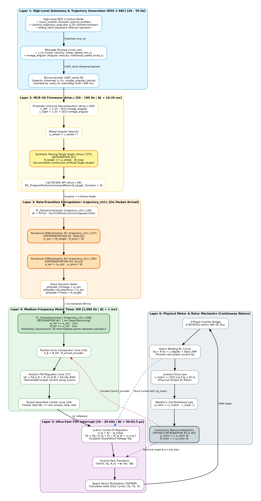

# Control Diagrams & Flowcharts

This directory contains the visual diagrams, vector graphics, and editable source definitions for the **Ubiquity Robotics Magni MCB G6** control pipeline.

---

## 1. Primary Control Path: ROS 2 to Motor Physics

### High-Resolution Rendered Pipeline


* **Scalable Vector Graphic:** [control_path.svg](control_path.svg)
* **High-Resolution PNG:** [control_path.png](control_path.png)
* **Graphviz Source File:** [control_path.dot](control_path.dot)
* **Mermaid Source File:** [control_path.mmd](control_path.mmd)

---

## 2. Decoupled 2-DoF Velocity Impedance Control System

### Deep Architectural & Transfer Function Topology


* **Scalable Vector Graphic:** [velocity_impedance_control_system.svg](velocity_impedance_control_system.svg)
* **High-Resolution PNG:** [velocity_impedance_control_system.png](velocity_impedance_control_system.png)
* **Graphviz Source File:** [velocity_impedance_control_system.dot](velocity_impedance_control_system.dot)
* **Mermaid Source File:** [velocity_impedance_control_system.mmd](velocity_impedance_control_system.mmd)

### Topological Summing Elements & Control Loops

1. **Summing Element $\Sigma_v$ (Longitudinal Velocity Error):**
   $$e_v = v_{\text{des}} - v_{\text{odom}}$$
   Subtracts measured wheel ground velocity ($v_{\text{odom}}$) from rate-limited trajectory velocity ($v_{\text{des}}$).
2. **Summing Element $\Sigma_\omega$ (Yaw Velocity Error):**
   $$e_\omega = \omega_{\text{des}} - \omega_{\text{gyro}}$$
   Subtracts measured spatial IMU rate gyro ($\omega_{\text{gyro}}$) from rate-limited trajectory yaw rate ($\omega_{\text{des}}$).
3. **Summing Element $\Sigma_F$ (Total Longitudinal Modal Wrench):**
   $$F_{\text{linear\_total}} = \underbrace{M_{\text{eff}} \cdot a_{\text{des}}}_{\text{Linear Inertia FF}} + \underbrace{F_{\text{strib\_ff}}}_{\text{Breakaway Stiction FF}} + \underbrace{F_{\text{viscous}}}_{\text{Grease Shear FF}} + \underbrace{B_d \cdot e_v}_{\text{Virtual Viscous Damper}} + \underbrace{K_{i,v} \int e_v dt}_{\text{Disturbance Trim}}$$
4. **Summing Element $\Sigma_\tau$ (Total Yaw Modal Wrench):**
   $$\tau_{\text{yaw\_total}} = \underbrace{I_{\text{eff}} \cdot \alpha_{\text{des}}}_{\text{Rotational Inertia FF}} + \underbrace{\tau_{\text{scrub\_ff}}}_{\text{Tire Scrub FF}} + \underbrace{B_{d,\omega} \cdot e_\omega}_{\text{Rotational Damper}} + \underbrace{K_{i,\omega} \int e_\omega dt}_{\text{Yaw Trimmer}}$$
5. **Summing Elements $\Sigma_L$ & $\Sigma_R$ (Algebraic Kinetic Mixer $\boldsymbol{\tau} = \mathbf{J}^T \mathbf{W}$):**
   $$\tau_{\text{wheel\_left}} = \tau_{\text{common}} - \Delta \tau = \frac{r}{2} F_{\text{linear\_total}} - \frac{r}{b} \tau_{\text{yaw\_total}}$$
   $$\tau_{\text{wheel\_right}} = \tau_{\text{common}} + \Delta \tau = \frac{r}{2} F_{\text{linear\_total}} + \frac{r}{b} \tau_{\text{yaw\_total}}$$
6. **Summing Elements $\Sigma_{Iq}$ & $\Sigma_{Id}$ (High-Speed FOC Regulators @ 16–20 kHz):**
   $$e_{Iq} = I_q^* - I_{q,\text{meas}} \implies V_q = \text{PI}(e_{Iq}) + \text{Back-EMF}$$
   $$e_{Id} = 0 - I_{d,\text{meas}} \implies V_d = \text{PI}(e_{Id}) - \text{Decoupling}$$

---

## 3. How to View and Edit Online

### A. Editing via Mermaid Live Editor
You can copy the contents of [`velocity_impedance_control_system.mmd`](velocity_impedance_control_system.mmd) or [`control_path.mmd`](control_path.mmd) directly into [Mermaid Live Editor](https://mermaid.live).
1. Open [https://mermaid.live](https://mermaid.live).
2. Paste the text into the left code editor.
3. Edit nodes, labels, or equations in real time with instant graphical preview.
4. Export as SVG, PNG, or Markdown.

### B. Regenerating Graphviz Diagrams Locally
To recompile the `.dot` files into vector SVG or high-resolution PNG:
```bash
# Render Velocity Impedance diagram
dot -Tsvg velocity_impedance_control_system.dot -o velocity_impedance_control_system.svg
dot -Tpng -Gdpi=160 velocity_impedance_control_system.dot -o velocity_impedance_control_system.png

# Render Control Path diagram
dot -Tsvg control_path.dot -o control_path.svg
dot -Tpng -Gdpi=160 control_path.dot -o control_path.png
```

---

## 4. Directory Contents

| File | Format | Purpose |
| :--- | :--- | :--- |
| [`velocity_impedance_control_system.svg`](velocity_impedance_control_system.svg) | SVG (Vector) | Lossless vector diagram of the Decoupled 2-DoF Modal Velocity Impedance System. |
| [`velocity_impedance_control_system.png`](velocity_impedance_control_system.png) | PNG (Raster) | High-resolution ($160\text{ DPI}$) raster rendering of the complete impedance topology. |
| [`velocity_impedance_control_system.dot`](velocity_impedance_control_system.dot) | Graphviz DOT | Source definition with summing elements, dynamic channels, and plant transfer functions. |
| [`velocity_impedance_control_system.mmd`](velocity_impedance_control_system.mmd) | Mermaid | Pure markdown flowchart for GitHub preview and online editing at [mermaid.live](https://mermaid.live). |
| [`control_path.svg`](control_path.svg) | SVG (Vector) | Lossless scalable vector diagram tracing the full stack from ROS 2 to motor physics. |
| [`control_path.png`](control_path.png) | PNG (Raster) | High-resolution raster rendering of the multi-rate execution layers. |
| [`control_path.dot`](control_path.dot) | Graphviz DOT | Source Graphviz definition of the multi-rate execution layers. |
| [`control_path.mmd`](control_path.mmd) | Mermaid | Pure markdown flowchart of the multi-rate execution layers. |
